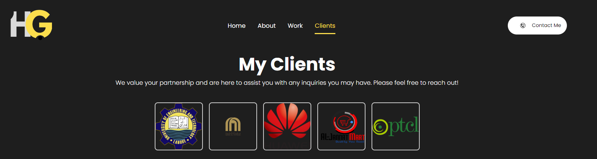

# React Portfolio Website - CI/CD Pipeline Setup

This guide walks through setting up a React portfolio website with Git, Docker, and Jenkins to create a Continuous Integration/Continuous Deployment (CI/CD) pipeline. It covers local development, Docker containerization, and automating the build and deployment with Jenkins.

---

## Table of Contents

- [Project Overview](#project-overview)
- [Technologies Used](#technologies-used)
- [Step 1: Local Development Setup](#step-1-local-development-setup)
- [Step 2: GitHub Repository Setup](#step-2-github-repository-setup)
- [Step 3: Docker Integration](#step-3-docker-integration)
- [Step 4: Jenkins CI/CD Pipeline Setup](#step-4-jenkins-ci-cd-pipeline-setup)
- [Conclusion](#conclusion)

---

## Project Overview

This project is a **React.js portfolio website** designed to showcase your skills, projects, and contact information. It will be built, tested, and deployed using Docker containers and automated through a Jenkins CI/CD pipeline.


[text](README.md)         

---

## Technologies Used

- **React.js**: JavaScript library for building user interfaces.
- **Git**: Version control system.
- **Docker**: Tool to containerize your application.
- **Jenkins**: Automation server for CI/CD.

---

## Step 1: Local Development Setup

### 1.1 Install Node.js and npm

Before starting, install **Node.js** and **npm**. They are required to run and build the React app.

- Download from [Node.js official site](https://nodejs.org/en/).
- Verify installation by running:

```bash
node -v
npm -v

git clone https://github.com/Hamza-Ghaffar/portfoliowebsite-v1.git
cd portfoliowebsite-v1

npm install
npm start
# Use the official Node.js image
FROM node:14

# Set the working directory
WORKDIR /usr/src/app

# Copy package.json and package-lock.json
COPY package*.json ./

# Install dependencies
RUN npm install

# Copy the rest of the application code
COPY . .

# Build the app
RUN npm run build

# Expose the port
EXPOSE 3000

# Start the application
CMD ["npm", "start"]

node_modules
build
*.log
docker build -t react-portfolio .
docker run -p 3000:3000 react-portfolio
docker run -d -p 8080:8080 -p 50000:50000 jenkins/jenkins:lts
#!/bin/bash

# Define the app and container names
APP_NAME="my-react-app-container"
IMAGE_NAME="react-portfolio"

# Navigate to the app directory
cd "$WORKSPACE"  # Jenkins workspace directory

# Check if the container is already running and remove it if it exists
if [ "$(docker ps -aq -f name=$APP_NAME)" ]; then
    echo "Stopping and removing existing container: $APP_NAME"
    docker rm -f $APP_NAME  # Remove the existing container
fi

# Remove old images if they exist
if [ "$(docker images -q $IMAGE_NAME)" ]; then
    echo "Removing old image: $IMAGE_NAME"
    docker rmi -f $IMAGE_NAME  # Remove the old image
fi

# Build the Docker image
echo "Building the Docker image: $IMAGE_NAME"
docker build -t $IMAGE_NAME .

# Run the Docker container
echo "Running the Docker container: $APP_NAME"
docker run -d -p 3000:3000 --name $APP_NAME $IMAGE_NAME
```
